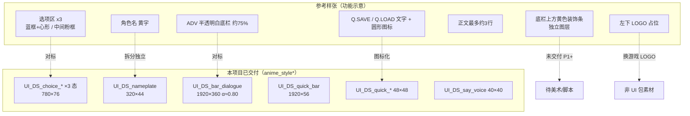

# Say 屏 UI 说明图 · 参考样张 × 已交付资源对照

> **版本**：1.0 · 2026-05-19  
> **参考**：青春校园类型 UI 包 · ADV 预览样张（功能对标，**非**视觉描摹）  
> **已交付**：`anime_style/`（樱粉）· `anime_style_blue/`（晴空蓝）· 各 **25** 张 `UI_DS_*`  
> **配色定调**：`UI_THEME_COLORS.md` · **尺寸**：`UI_SPEC.md`  
> **线框示意图**：`UI_SAY_LAYOUT_DIAGRAM.png`（`build_ui_say_layout_diagram.py`）  
> **实机感合成预览**：`previews/latest/UI_SAY_PREVIEW_sheet_*.png`（随 `build_ui_anime_say.py` 自动生成 · `UI_WORKFLOW.md`）

---

## 1. 总览：一屏里有什么

参考样张展示的是 **ADV 对话 + 居中选项 + 底栏快捷操作** 的合成效果。  
本项目已交付的是 **可拆分的 PNG 零件** + Ren'Py 叠层，需在引擎里拼成同样布局。



---

## 2. 布局线框（1920×1080）

### 2.1 参考样张 · 元素分区

```
┌──────────────────────────────────────────────────────────── 1920 ─┐
│  [天空 / 背景 / 立绘区]                                            │
│                                                                   │
│              ┌─ 选项① 蓝框 + 左心 + 右黄装饰 ─┐                      │
│              ├─ 选项② 粉框 + 左心 + 右黄装饰 ─┤  ← 屏中 y≈0.5      │
│              └─ 选项③ 蓝框 + 左心 + 右黄装饰 ─┘                      │
│                                                                   │
│         ══ 黄色装饰条（与底栏分离，勿当底栏透明度）══                  │
│  ┌──────────────────────────────────────────────────────────┐    │
│  │ 角色名字(黄)  [喇叭]                                         │    │
│  │ 正文……（样张说明约三行上限）                                  │    │
│  │                                    Q.LOAD Q.SAVE [图标组] [X] │    │
│  └──────────────────────── ADV 底栏 预览约 75% 不透明 ─────────┘    │
│  [左下 LOGO 占位 → 换本游戏 Logo]                                  │
└──────────────────────────────────────────────────────────── 1080 ─┘
```

### 2.2 本项目 · Ren'Py 推荐叠层（樱粉或晴空蓝二选一）

```
┌──────────────────────────────────────────────────────────── 1920 ─┐
│  show 立绘 · x≈72 · yalign 1.0 · zorder > 底栏                      │
│                                                                   │
│              ┌─ UI_DS_choice_normal/hover/selected ─┐              │
│              │  780×76 · spacing 14 · xalign 0.5    │              │
│              └──────────────────────────────────────┘              │
│                                                                   │
│  (可选) 未来：独立装饰 PNG，zorder 在底栏之上、姓名条之下              │
│  ┌──────────────────────────────────────────────────────────┐    │
│  │ add UI_DS_nameplate  320×44  x≈400 y≈底栏上缘              │    │
│  │ add UI_DS_say_voice  40×40   靠姓名/正文侧                  │    │
│  │ gui 正文 x=400 w=1420 · 2~3 行 · 色见 UI_THEME_COLORS      │    │
│  │ add UI_DS_bar_dialogue 1920×360 yalign 1.0  α≈0.80(已烘焙)  │    │
│  └──────────────────────────────────────────────────────────┘    │
│  add UI_DS_quick_bar 1920×56 · yalign 1.0 贴底栏顶缘上方           │
│  hbox: UI_DS_quick_* 48×48（无 Q.SAVE 文字条，用图标）              │
└──────────────────────────────────────────────────────────── 1080 ─┘
```

**立绘与底栏分离**：角色不在 `bar_dialogue.png` 内，与参考样张一致。

---

## 3. 逐件对照表

| # | 参考样张中的元素 | 样张标注/要点 | 已交付 PNG | 路径 | 对齐情况 | 说明 |
|---|------------------|---------------|------------|------|----------|------|
| A | ADV 对话底栏 | 预览 **75%** 不透明；宽条白/浅色 | `UI_DS_bar_dialogue.png` | `anime_style*` | ◐ 接近 | 尺寸 **1920×360**；脚本峰值 α **0.80**（略比样张实，可 Ren'Py 再乘 `alpha` 或改脚本常量） |
| B | 旁白底栏 | 更透、无姓名 | `UI_DS_bar_narration.png` | 同上 | ✓ | α **0.67**；`who` 为空时用，**勿**与 A 同屏叠放 |
| C | 角色名 | 样张为 **黄字** 印在底栏上 | `UI_DS_nameplate.png` | 同上 | ✓ | **12×44 左色条 only** + `text who`；字色 `#FF70A8` / `#41B9FF` |
| D | 选项框 ×3 | 蓝框；**中间一条粉框**；左 **心形**；右 **黄笔触** | `UI_DS_choice_{normal,hover,selected}.png` | 同上 | ◐ 功能有、装饰无 | **780×76** 胶囊 + 主题描边；**无**心形/黄笔触；粉/蓝为 **整主题切换**，非单条混色 |
| E | 底栏上黄色装饰 | **与底栏分离**，不建议改底栏透明度去带 | — | — | ✗ 未交付 | P1+ 可做 `UI_DS_say_deco_top.png` 等独立层 |
| F | 句内语音/喇叭 | 样张小喇叭 | `UI_DS_say_voice_{default,hover}.png` | 同上 | ✓ | **40×40**，樱粉/蓝主题色 |
| G | 快捷：存档/读档 | 样张 **Q.SAVE / Q.LOAD 文字** | `UI_DS_quick_save/load_{default,hover}.png` | 同上 | ◐ | **48×48 图标**；文字用 `textbutton` 或 `alt` 在 Ren'Py 补 |
| H | 快捷：其它 | 列表、播放、跳过等 | `UI_DS_quick_{auto,skip,hide,history,settings,exit}_*` | 同上 | ✓ | 共 8 项 ×2 态；圆形描边逻辑见 `UI_THEME_COLORS.md` §4 |
| I | 快捷条底板 | 样张嵌在底栏右下 | `UI_DS_quick_bar.png` | 同上 | ◐ | **1920×56** 顶圆角条，宜贴在 **底栏上方** 或屏底第二轨 |
| J | 关闭/退出 | 右侧蓝底 **X** | `UI_DS_quick_exit_{default,hover}.png` | 同上 | ✓ | 圆形退出图标，非方形蓝钮 |
| K | 左下 LOGO | 样张写明 **素材包不含**，换游戏 Logo | — | — | — | 用 `add "images/logo.png"`，不进 `UI_DS_*` |

图例：**✓** 已覆盖 · **◐** 部分覆盖/需引擎拼装 · **✗** 未交付

---

## 4. 配色：样张 vs 项目定调

| 样张观感 | 本项目（已锁定） |
|----------|------------------|
| 选项以 **亮蓝** 为主，**一条粉** 强调 | **整屏二选一**：樱粉 `anime_style/` 或晴空蓝 `anime_style_blue/` |
| 角色名 **黄色** | 姓名 **主题强调色**（粉 `#FF70A8` / 蓝 `#41B9FF`） |
| 选项左 **红心**、右 **黄装饰** | 无；保持原创轮廓，避免描摹参考包 |
| 底栏 **≈75%** 不透明 | PNG 烘焙 **80%**（对话）/ **67%**（旁白） |

详细 Token → **`UI_THEME_COLORS.md`**。

---

## 5. 文件清单（say 路径 · 每主题 25 张）

| 分组 | 文件 |
|------|------|
| 底栏 | `UI_DS_bar_dialogue.png` · `UI_DS_bar_narration.png` |
| 姓名 | `UI_DS_nameplate.png` |
| 选项 | `UI_DS_choice_normal.png` · `hover` · `selected` |
| 快捷条 | `UI_DS_quick_bar.png` |
| 快捷图标 | `auto` `skip` `hide` `history` `save` `load` `settings` `exit` × `default/hover` |
| 语音 | `UI_DS_say_voice_default.png` · `hover` |

生成：`python scripts/build_ui_anime_say.py pink|blue|all`

---

## 6. Ren'Py 拼装示例（晴空蓝线）

```renpy
# 主题目录（樱粉则改为 anime_style/）
define UI = "UI/anime_style_blue/"

screen say(who, what):
    style_prefix "say"
    if who:
        add UI + "UI_DS_bar_dialogue.png":
            xalign 0.5 yalign 1.0
        add UI + "UI_DS_nameplate.png":
            xpos 400 ypos 700  # 按实机微调
        text who id "who"
        add UI + "UI_DS_say_voice_default.png":
            xpos 720 ypos 708
    else:
        add UI + "UI_DS_bar_narration.png":
            xalign 0.5 yalign 1.0
    text what id "what"

screen choice(items):
    vbox:
        xalign 0.5 yalign 0.5
        spacing 14
        for i in items:
            textbutton i.caption:
                action i.action
                idle_background UI + "UI_DS_choice_normal.png"
                hover_background UI + "UI_DS_choice_hover.png"
                selected_idle_background UI + "UI_DS_choice_selected.png"
                xsize 780 ysize 76

screen quick_menu():
    add UI + "UI_DS_quick_bar.png":
        xalign 0.5 yalign 1.0 yoffset -360
    hbox:
        xalign 0.98 yalign 1.0 yoffset -400 spacing 8
        imagebutton:
            idle UI + "UI_DS_quick_save_default.png"
            hover UI + "UI_DS_quick_save_hover.png"
            action QuickSave()
        # …其余图标同理
```

坐标需按实机微调；数值锚点见 **`UI_SPEC.md` §3**。

---

## 7. 差异汇总与后续建议

| 优先级 | 差异 | 建议 |
|--------|------|------|
| P0 可选 | 底栏透明度 80% vs 样张 75% | 实机偏实则 `BAR_A_DIALOGUE = 0.75` 重跑 `blue`/`pink` |
| P0 可选 | 需要 Q.SAVE 文字 | `screen quick_menu` 在图标旁 `text "Q.SAVE"`，字体色用 `ACCENT` |
| P1 | 底栏上 **黄色装饰条** | 独立 PNG + 不改底栏 α |
| P1 | 选项 **心形 / 右下黄笔触** | 若要接近样张情绪，用 **原创** 小图 `add` 在选项左侧/右侧，勿贴参考包图 |
| P1 | 单条粉框选项 | 用 `selected` 态或剧情变量切换 `idle_background` 樱粉/蓝素材 |
| — | 左下 LOGO | 游戏 Brand 图，非 UI_DS |

---

## 8. 相关文档

| 文档 | 内容 |
|------|------|
| `UI_SPEC.md` | 宽×高、gui 数字 |
| `UI_THEME_COLORS.md` | 樱粉 / 晴空蓝定调 |
| `UI_ASSET_MAP_FULL.md` | 全项目 96 项对标进度 |
| `RENPY_GUI_SNIPPET.rpy` | gui 片段 |
| `anime_style/README.md` | 粉套说明 |

---

*说明图 ID：`say-layout-guide-v1-20260519`*
